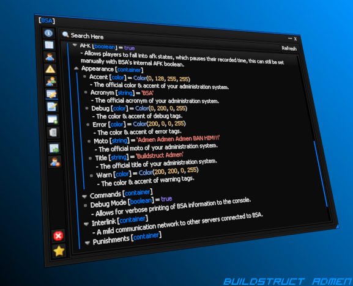

# Garry's Mod
Garry's Mod is amongst our first integration for BSA.\
This is created under Lua & MySQLOO drivers, no other dependencies are required.

!!!abstract
    We are still making major changes to this section, as development is not considered released.\
    **BASELINE 1.0** is in relation to the release to Buildstruct, not public.

This section is to document the behaviors of toolsets deemed accessible to developers without disrupting core.

  

## Features
- Interface system designed for sleek but powerful management.
- Extremely abstract command system for multi-platform communication.
- Highly configurable and dynamic configuration systems with export/import capabilities.
- Extensive and endless language and theme customizations.
- Plugin systems for direct and togglable attachments to BSA core.
- Multi-server communication and database dispatching.
- Support for BSA's multi-verse of different platforms, services and providers.
- Designed for large communities with diverse player-bases.

## Importing
We cannot compensate for all admin systems and create customized export/import tools for them.\
With this understanding we expect that an individual with DB experience and Lua experience is present.

For ease of importation we allow a mode called "standalone".\
This allows BSA to run with an existing administration system, preventing overrides from occuring.