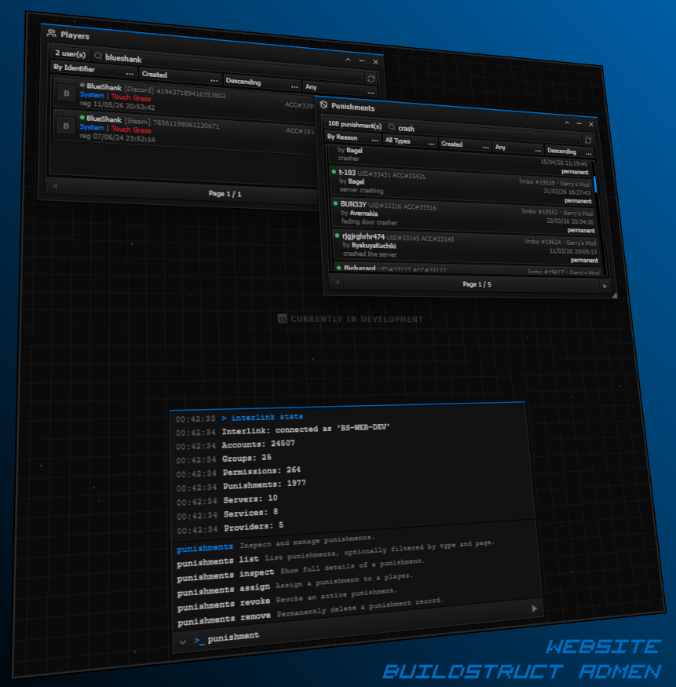

# Website
Universal command center allowing cross-server communication and signaling to every instance registered under BSA.\
This allows administrators to remotely perform actions on BSA instances without having to join or connect to them individually.

!!!note
	Users can sign-in but only view information they are allowed to view on themselves (most features are gated behind a permission).\
	You can change this behavior by requiring a permission to see the panel itself in the configurate system.

!!!warning
	Due to security concerns, we recommend that the SSO providers support 2FA.\
	While we cannot verify this programmatically for some SSO providers, you should enforce this.

---

  

A window-based terminal with emphasis on cross-referencing & multi-platform management.

## Features

- BSA styled command systems similar to Platform Garry's Mod.
- Customizable SSO logins from Steam to Discord, or anything that a provider can link towards.
- OAuth provider so third-party applications can authenticate users through BSA and receive their identity and groups.
- Draggable and resizable windows for easy management and cross referencing of information.
- Highly configurable on-the-fly similar to Platform Garry's Mod configurate system.
- Plugins for both front-end and back-end additions without affecting core features.
- Public & Private API endpoints for external services & automation.
- Cache coherence systems with data that dynamically changes on the fly.
- Driven by Bun, Vite & Svelte for seemless deployment on anything.
- Oversee connected infrastructure all-in-one place.

!!! abstract
	Website is functional and actively being developed.\
	Documentation for this platform is still a work in progress.

	✅ **Environment Progress**
	[=100% "100%"]{: .candystripe .candystripe-animate}

	✅ **Technical Progress**
	[=100% "100%"]{: .candystripe .candystripe-animate}

	🛠️ **Integration Progress** - 🛑 Blocker for public release BSA OSS
	[=70% "70%"]{: .candystripe .candystripe-animate}

	🛠️ **Documentation Progress** - 🛑 Currently writing it out
	[=50% "50%"]{: .candystripe .candystripe-animate}