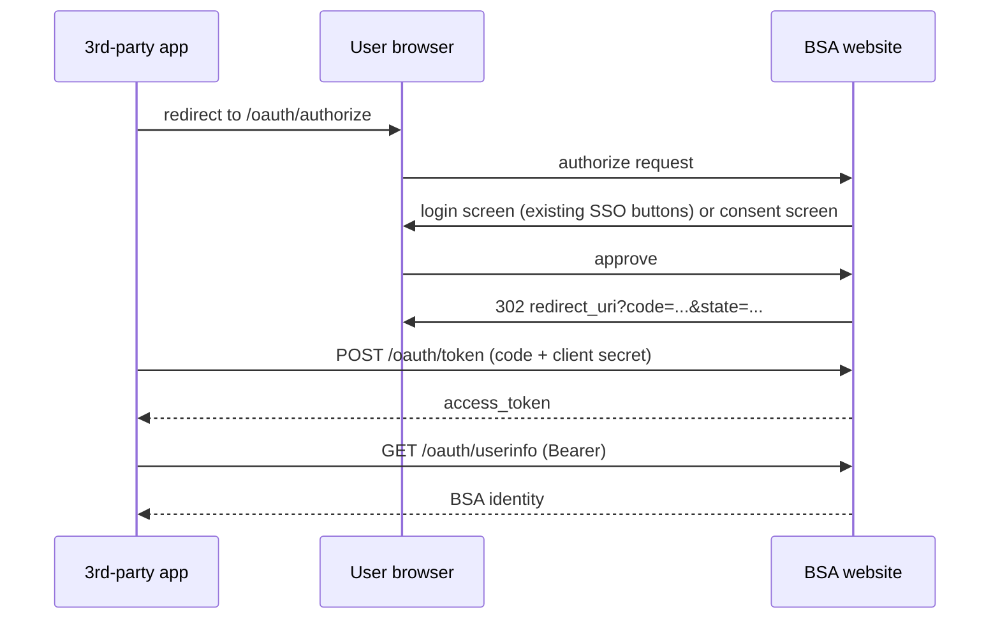

# OAuth Provider

BSA can act as an OAuth 2.0 authorization server, letting third-party applications authenticate users through BSA instead of building their own login system.\
The third party receives the player's BSA identity (stable player id, username, linked provider accounts, group memberships) and never sees an upstream Steam or Discord token.

!!!note
	The OAuth provider only vouches for players that already exist in BSA.\
	An upstream identity (SteamID64, Discord snowflake) that is not linked to a BSA player is rejected, exactly like a panel login.

---

## Flow



Returning users who previously approved the app skip the consent screen automatically (see [Grant TTL](#configuration)).\
A remembered grant is only reused while it covers the requested scopes and the app is enabled.

## Scopes

| Scope | Grants access to |
|---|---|
| `profile` | Player id (`sub`), username, and every account linked to the player (provider name + identifier) |
| `groups` | BSA group memberships: name, alias, and weight |
| `permissions` | The player's effective permission names, resolved from their groups the same way the panel checks them |

Each client is restricted to a set of scopes chosen when it is registered.\
Requesting a scope outside that set fails with `invalid_scope`.

## Endpoints

| Endpoint | Description |
|---|---|
| [GET /oauth/authorize](authorize.md) | Starts the authorization code flow |
| [POST /oauth/token](token.md) | Exchanges an authorization code for an access token |
| [GET /oauth/userinfo](userinfo.md) | Returns the identity behind an access token |
| [GET /.well-known/openid-configuration](discovery.md) | Discovery metadata for standard client libraries |

Authorization codes are single-use and expire after 60 seconds (configurable).\
Access tokens are opaque Bearer tokens with a configurable lifetime.\
Failed PKCE verification burns the code, and codes are bound to the client, redirect URI, and PKCE challenge.

## Client Management

Clients are managed by staff from the dashboard's OAuth window, gated behind `management.security`.\
Creating a client shows the secret once, only a SHA-256 hash is stored.\
Disabling or deleting a client immediately revokes its outstanding tokens and codes.

## Configuration

All settings live under `baseline.web.oauth` in the configurate system (requires `management.security`).

| Key | Type | Default | Notes |
|---|---|---|---|
| `enabled` | boolean | `false` | Master switch. Off = all `/oauth` requests are refused |
| `code_ttl` | number | `60` | Authorization code lifetime in seconds (10 to 600) |
| `token_ttl` | number | `3600` | Access token lifetime in seconds (60 to 86400) |
| `grant_ttl` | number | `7776000` | How long a remembered consent stays valid, in seconds. `0` = consent must be given every time |

## Security

- Bans and geoblocks are enforced when the user authorizes an app.
- Every userinfo call re-checks live ban state, so banning a player cuts off already-issued tokens within seconds.
- Bans, kicks, and geoblock sweeps also delete the player's outstanding tokens outright.
- The session cookie uses `SameSite=Lax`, so third-party initiated logins carry the existing panel session.
- Token and authorization endpoints are rate limited (per IP), userinfo is rate limited per token.

!!!warning
	OAuth logins deliberately do **not** require the panel's `dashboard` permission.\
	A player without panel access can still authenticate to third-party apps as long as they are not banned or geoblocked.

## Integration

Any generic OAuth2 client library works with the discovery document.\
Minimal manual flow:

```js
// 1. redirect the browser
const authUrl = new URL("https://bsa.example.com/oauth/authorize");
authUrl.searchParams.set("response_type", "code");
authUrl.searchParams.set("client_id", CLIENT_ID);
authUrl.searchParams.set("redirect_uri", "https://mysite.com/auth/bsa/callback");
authUrl.searchParams.set("scope", "profile groups");
authUrl.searchParams.set("state", randomState());
authUrl.searchParams.set("code_challenge", s256(verifier));
authUrl.searchParams.set("code_challenge_method", "S256");

// 2. in the callback route, server-to-server
const res = await fetch("https://bsa.example.com/oauth/token", {
	method: "POST",
	headers: { "Content-Type": "application/x-www-form-urlencoded" },
	body: new URLSearchParams({
		grant_type: "authorization_code",
		code, redirect_uri,
		client_id: CLIENT_ID, client_secret: CLIENT_SECRET,
		code_verifier: verifier,
	}),
});
const { access_token } = await res.json();

// 3. read identity
const me = await fetch("https://bsa.example.com/oauth/userinfo", {
	headers: { Authorization: `Bearer ${access_token}` },
}).then(r => r.json());
```

`me.sub` is the stable BSA player id, `me.accounts` contains every linked provider identifier, and `me.groups` lists the player's BSA ranks.\
Game server sites can use the groups payload to auto-rank their users.
